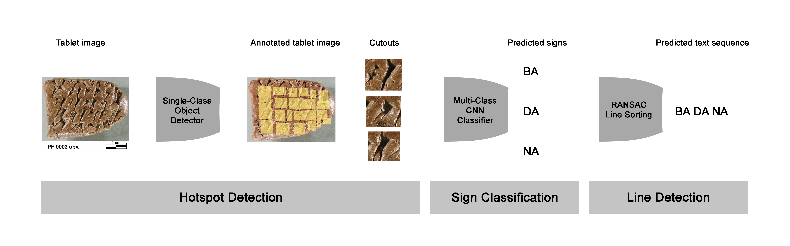

# deepscribe

This repository contains the (reimplemented in torchvision) code for the paper "DeepScribe: Localization and Classification of Elamite Cuneiform Signs Via Deep Learning". 

# Installation

Install conda environment using `environment.yml`, and install the `deepscribe2` module with `pip install -e .` 

# Dataset

## Background

From the [OI](https://oi.uchicago.edu/research/publications/oip/persepolis-fortification-tablets): 

    With over 2100 texts published, the Persepolis Fortification Texts in Elamite, transcribed, interpreted, and edited by the late Richard Hallock, already form the largest coherent body of material on Persian administration available to us; a comparable, but less legible, body of material remains unpublished, as does the smaller group of Aramaic texts from the same archive. Essentially, they deal with the movement and expenditure of food commodities in the region of Persepolis in the fifteen years down to 493. Firstly, they make it absolutely clear that everyone in the state sphere of the Persian economy was on a fixed ration-scale, or rather, since some of the rations are on a scale impossible for an individual to consume, a fixed salary expressed in terms of commodities. The payment of rations is very highly organized. Travelers along the road carried sealed documents issued by the king or officials of satrapal level stating the scale on which they were entitled to be fed. Tablets sealed by supplier and recipient went back to Persepolis as a record of the transaction. Apart from a few places in Babylonia for short periods, Persepolis is now the best-documented area in the Achaemenid empire. What generalizations or other insights this provides for other areas is perhaps likely to remain one of the main methodological problems for Achaemenid scholarship.  [From an article by D. M. Lewis, "The Persepolis Fortification Texts," in Achaemenid History IV: Centre and Periphery, Proceedings of the Groningen 1986 Achaemenid History Workshop, edited by Heleen Sancisi-Weerdenburg and Amélie Kuhrt (Leiden: Nederlands Instituut voor het Nabije Oosten, 1990), pp. 2-6].

## Download

You can download the publicly availble subset of the Persepolis Fortification Archive from [here](https://ochre.lib.uchicago.edu/deepscribe/deepscribe_2023_02_04_public.tar.gz). It should contain the following files:
- ImagesWithHotspots.json
    - This is a JSON file containing annotations for each image present in the images/ folder.
- images/
    - Folder containing tablet images.
- categories.txt.
    - File mapping sign names to the `category_id` values used for labels. 

## DataModules

This Python package includes two [DataModules](https://pytorch-lightning.readthedocs.io/en/stable/data/datamodule.html) that package and preprocess PFA data for ease of training. The first is the `PFADetectionDataModule` which handles bounding box data, and `PFAClassificationDataModule` which pulls out individual bounding boxes and produces a classification dataset. Some notes about each dataset are found below.

### `PFADetectionDataModule`

This DataModule is initialized with a folder path, and it requires that all of the files/directories listed about be present in the folder. An optional (but recommended) preprocessing step is to automatically crop images (`autocrop=True`, on by default) using the bounding box data - essentially getting rid of non-annotated regions in the image and/or image backdrop. If this is requested, the cropped images will be produced and cached the first time the DataModule is initialized. See `PFADetectionDataModule.prepare_data` for more information.

### `PFAClassificationDataModule`

This datamodule is initalized in the same way as the `PFADetectionDataModule`, but upon setup will convert the bounding box data/images into an [ImageFolder](https://pytorch.org/vision/main/generated/torchvision.datasets.ImageFolder.html) - like dataset. Note that due to the imbalance of the data annotations, some signs will most likely be missing from some folds, which required modification to the default ImageFolder dataset object (see `deepscribe2/datasets/dataset_folder.py`). 

# Models

## Detection

For bounding box detection, we use the [RetinaNet](https://arxiv.org/abs/1708.02002) architecture as implemented in [torchvision](https://pytorch.org/vision/main/models/retinanet.html). An earlier version of this repository (and the original implementation used in the paper!) used [Detectron2](https://detectron2.readthedocs.io/en/latest/), but future research will stick more to torchvision-based models. Feel free to swap in other object detection methods and give them a try! There's some test code in the repo experimenting with [DETR](https://github.com/facebookresearch/detr) but that's a WIP. 

It's also possible to train full end-to-end bounding box detection and classification models with these DataModules, and we recommend giving it a try! Our full pipeline is fairly similar to older object detection work (R-CNN, etc) that trained proposal networks and bounding box classifiers separately and put them toegether, which we did to explore how difficult the classification problem was in isolation. Future work will likely train the modules end-to-end. 

## Classification

Classification models can be initialized with any model supported by [TIMM](https://timm.fast.ai). 

## Line Detection

We use a sequential version of the RANSAC algorithm to sort predicted box location (by centroid) into discrete lines of text. It's implemented approximately like a Scikit-Learn [Estimator](https://scikit-learn.org/stable/developers/develop.html) but doesn't fit the specification exactly. 

## E2E Pipeline

The end-to-end pipeline is very simple - it will perform bounding box detection, classification, and line sorting, and produce an estimated transliteration for the tablet. We primarily use this with detection and classification methods separately, but the pipeline should support a joint detection+classifcation model.  

# Example

Example notebooks can be found in the `notebooks` folder, or on colab at COLAB_URL.

# Contact Us

Feel free to contact [Edward Williams](mailto:eddiecwilliams@gmail.com) with any questions or issues, or post them on GitHub! We're also very interested in collaborating with research groups that are exploring cuneiform computer vision on other corpora, and would be excited to chat if you're working on something similar! 